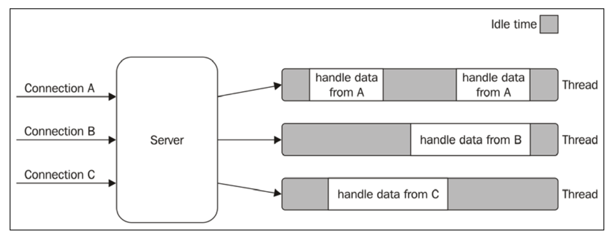

# The Node.js Platform

Welcome to an exploration of the Node.js platform! This guide covers key principles and philosophies that define Node.js, delving into the core aspects of its design and usage.

## Overview:
- **The Node.js Philosophy**: Core principles and the "Node way".
- **The Reactor Pattern**: The mechanism at the heart of Node.js's asynchronous event-driven architecture.
- **JavaScript on the Server**: Insights into running JavaScript on the server compared to the browser.

---

## The Node.js Philosophy

Node.js, like every platform, has a set of guiding principles that shape its evolution and influence application development. These principles draw from the vision of its creator, Ryan Dahl, contributions from core developers, and influences from the broader JavaScript ecosystem.

These guidelines, while flexible, serve as valuable reference points for developers looking to design robust applications. [Learn more about Node.js philosophies](#nodejsdp.link/dev-philosophies).

### Small Core

Node.js maintains a **small core**, meaning the runtime and built-in modules provide only the essential features. The rest is left to the **userland** (or **userspace**), an expansive ecosystem of community-driven modules that extend the platform's capabilities.

### Small Modules

Modules are fundamental in Node.js, serving as the building blocks for applications and libraries. A core Node.js principle is to create **small, focused modules**, inspired by the Unix philosophy:

- **Small is beautiful.**
- **Make each program do one thing well.**

Node.js, supported by package managers like **npm** and **yarn**, effectively handles **dependency hell** by allowing different versions of a package to coexist without conflict. This approach encourages high modularity, enabling developers to build with numerous small, single-purpose dependencies—a practice that might seem impractical on other platforms.

#### Advantages of Small Modules:
- **Easy to Understand and Use**: Clear, single-purpose functionality.
- **Simple to Test and Maintain**: Reduced complexity and scope.
- **Perfect for Browser Use**: Lightweight and efficient for front-end applications.

This philosophy drives extreme levels of reusability, even down to micro-modules containing just a few lines of code, like a regex for email validation. [Explore more regex examples](#nodejsdp.link/email-regex).

By adopting these principles, Node.js elevates the **Don't Repeat Yourself (DRY)** philosophy, maximizing code reuse and modularity.

---

Node.js's approach to small cores and modules is foundational to its success and versatility. Understanding these principles will help you make the most of the Node.js ecosystem, whether you're developing server-side solutions or front-end components. Keep these philosophies in mind as you build your next project with Node.js!

---

## Simplicity and pragmatism

Have you ever heard of the **Keep It Simple, Stupid (KISS)** principle? Richard
P. Gabriel, a prominent computer scientist, coined the term "worse is better" to describe the model whereby less and simpler functionality is a good design choice for software. In his essay The Rise of "Worse is Better" he says:

```
The Design must be simple, both in implementation and interface. It is more important for the implementation
to be simple then the interface. Simplicity is the most important consideration in a design.
```

Designing simple, as opposed to perfect, fully featured software is a good practice for several reasons: it takes less effort to implement, it allows shipping faster
with fewer resources, it's easier to adapt, and, finally, it's easier to maintain and understand. The positive effects of these factors encourage community contributions and allow the software itself to grow and improve.

--- 

## How Node.js works

We will gain an understanding of how Node.js works internally and be introduced to the reactor pattern, which is the heart of the asynchronous nature or Node.js. We will go through the main concepts behind the pattern, such as the single-threaded architecture and the non-blocking I/O, and you will see how this creates the foundation for the entire Node.js platform.

## I/O is slow 
I/O (short for input/output) is definitely the slowest among the fundamental operations of a computer. Accessing the RAM is in the order of nanoseconds (10E-9 seconds), while accessing data on the disk or the network is in the order of milliseconds (10E-3 seconds). The same applies to the bandwidth. RAM has a transfer rate consistently in the order of GB/s, while the disk or network varies from MB/s to optimistically GB/s. I/O is usually not expensive in terms of CPU, but it adds a delay between the moment the request is sent to the device and the moment the operation completes. On top of that, we have to consider the human factor. In fact, in many ciccumstances, the input of an application comes from a real person - a mouse click, for example - so the speed and frequency of I/O doesn`t only depend on technical aspects and it can be many orders of magnitude slower then the disk or network.

## Blocking I/O
In Traditional blocking I/O programming, the function call corresponding to an I/O request will block the execution of the thread until the operation completes. This can range from a few milliseconds, in the case of disk access, to minutes or even more, in the case of data being generated from user actions, such as pressing a key, the following pseudocode shows a typical blocking thread performed against a socket:
```
// blocks the thread until the data is available
  data = socket.read()
// data is available
  print(data)
```

It is trivial to notice that a web server that is implemented using blocking I/O will not be able to handle multiple connections in the same thread. This is because each I/O operation on a socket will block the processing of any other connection. The traditional approach to solving this problem is to use a separate thread (or process) to handle each concurrent connection.

This way, a thread blocked on an I/O operation will not impact the availability of the other connections, because they are handled in seperate threads.

The following illustrates this scenario:
<figure>
  
  <figcaption>Data structures hierarchy</figcaption>
</figure>
